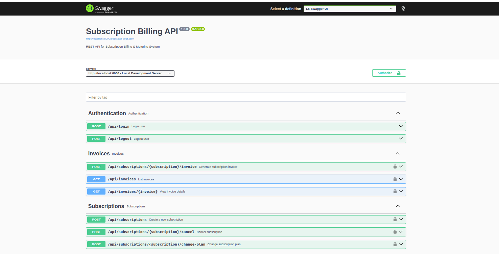

# Subscription Billing & Metering API

## Overview

Subscription Billing & Metering API is a RESTful application built with Laravel 12 for managing subscription-based billing. It allows customers to subscribe to plans, records metered usage events, calculates monthly billing, generates invoices, and provides secure APIs for subscription management.

The application uses Laravel Sanctum for authentication, Docker for containerized development, Swagger (OpenAPI) for API documentation, and includes automated feature tests for the core business workflows.

---

## Technology Stack

- PHP 8.2
- Laravel 12
- MySQL
- Redis
- Laravel Sanctum
- Docker & Docker Compose
- Swagger (L5 Swagger)

---

## Features

### Authentication

- Login using Laravel Sanctum
- Logout
- Protected API endpoints

### Subscription Management

- Create a subscription
- Change subscription plan with proration
- Cancel subscription at the end of the billing period
- Restrict customers to a single active subscription

### Usage Metering

- Record usage events
- Idempotent request handling
- Prevent duplicate usage records

### Billing

- Generate invoices
- Calculate monthly subscription charges
- Calculate overage charges
- Apply tax
- List invoices
- View invoice details

### Authorization

- Role-based access control
- Administrators can access all invoices
- Customers can access only their own invoices

### Additional Features

- Scheduled invoice generation
- Dockerized development environment
- Swagger API documentation
- Automated feature tests
- Database seeders with demo data

---

## Project Structure

```text
app/
├── Console/
├── Http/
│   ├── Controllers/
│   ├── Requests/
│   └── Resources/
├── Models/
├── Services/

database/
├── factories/
├── migrations/
├── seeders/

routes/

tests/
├── Feature/
└── Unit/
```

---

## Getting Started

### Clone the Repository

```bash
git clone https://github.com/SaifAliAnsari786/subscription-billing-api.git

cd subscription-billing-api
```

### Configure Environment

```bash
cp .env.example .env
```

### Start Docker Containers

If your system uses the legacy Compose binary (`docker-compose`):

```bash
docker-compose up -d --build
```

If your system supports Compose V2 (`docker compose`):

```bash
docker compose up -d --build
```

To install the Compose V2 CLI plugin for your user (no sudo required):

```bash
mkdir -p ~/.docker/cli-plugins
curl -SL https://github.com/docker/compose/releases/download/v2.18.1/docker-compose-linux-x86_64 -o ~/.docker/cli-plugins/docker-compose
chmod +x ~/.docker/cli-plugins/docker-compose
```

Or install Docker and the Compose plugin system-wide on Ubuntu (recommended on shared machines):

```bash
sudo apt-get update
sudo apt-get install -y ca-certificates curl gnupg lsb-release
curl -fsSL https://download.docker.com/linux/ubuntu/gpg | sudo gpg --dearmour -o /usr/share/keyrings/docker-archive-keyring.gpg
echo "deb [arch=$(dpkg --print-architecture) signed-by=/usr/share/keyrings/docker-archive-keyring.gpg] https://download.docker.com/linux/ubuntu $(lsb_release -cs) stable" | sudo tee /etc/apt/sources.list.d/docker.list > /dev/null
sudo apt-get update
sudo apt-get install -y docker-ce docker-ce-cli containerd.io docker-compose-plugin
```

### Install Dependencies

```bash
docker-compose exec app composer install
```

### Generate Application Key

```bash
docker-compose exec app php artisan key:generate
```

### Run Database Migrations and Seed Demo Data

```bash
docker-compose exec app php artisan migrate:fresh --seed
```

This command creates:

- Demo users
- Subscription plans
- Sample customer
- Active subscription

### Clean Checkout Verification

After copying `.env.example` to `.env` and starting Docker, this single command installs dependencies, prepares the app, seeds data, and runs the test suite:

```bash
docker-compose exec app sh -lc "composer install && php artisan key:generate && php artisan migrate:fresh --seed && php artisan test"
```

---

## Demo Credentials

### Administrator

```text
Email: admin@test.com
Password: password
```

### Customer

```text
Email: customer@test.com
Password: password
```

---

## Running the Application

Application

```text
http://localhost:8000
```

Swagger Documentation

```text
http://localhost:8000/api/documentation
```

---

## Docker Commands

Start containers

```bash
docker-compose up -d
```

Stop containers

```bash
docker-compose down
```

View running containers

```bash
docker-compose ps
```

Access the application container

```bash
docker-compose exec app bash
```

---

## Common Artisan Commands

Run migrations with seeders

```bash
docker-compose exec app php artisan migrate:fresh --seed
```

Generate Swagger documentation

```bash
docker-compose exec app php artisan l5-swagger:generate
```

Run automated tests

```bash
docker-compose exec app php artisan test
```

Generate invoices manually

```bash
docker-compose exec app php artisan billing:generate-invoices
```

Run scheduled tasks

```bash
docker-compose exec app php artisan schedule:run
```

Clear application cache

```bash
docker-compose exec app php artisan optimize:clear
```

---

## Authentication

Login endpoint

```http
POST /api/login
```

Use the returned Bearer token when accessing protected endpoints.

Example

```text
Authorization: Bearer YOUR_ACCESS_TOKEN
```

---

## API Endpoints

### Authentication

| Method | Endpoint |
|---------|----------|
| POST | `/api/login` |
| POST | `/api/logout` |

### Subscriptions

| Method | Endpoint |
|---------|----------|
| POST | `/api/subscriptions` |
| POST | `/api/subscriptions/{subscription}/change-plan` |
| POST | `/api/subscriptions/{subscription}/cancel` |

### Usage Events

| Method | Endpoint |
|---------|----------|
| POST | `/api/usage` |

### Invoices

| Method | Endpoint |
|---------|----------|
| POST | `/api/subscriptions/{subscription}/invoice` |
| GET | `/api/invoices` |
| GET | `/api/invoices/{invoice}` |

---

## Running Tests

Execute the automated test suite.

```bash
docker-compose exec app php artisan test
```

Current test coverage includes:

- Authentication
- Subscription Management
- Usage Events
- Invoice APIs

Expected result

```text
PASS
Tests: 12 passed (42 assertions)
```

---

## Scheduled Invoice Generation

Generate invoices manually

```bash
docker-compose exec app php artisan billing:generate-invoices
```

Run the scheduler

```bash
docker-compose exec app php artisan schedule:run
```

View scheduled tasks

```bash
docker-compose exec app php artisan schedule:list
```

---

## Assignment Coverage

This implementation includes:

- Authentication using Laravel Sanctum
- Subscription management
- Plan changes with proration
- Subscription cancellation
- Usage metering
- Idempotent event processing
- Invoice generation
- Overage billing
- Tax calculation
- Invoice listing
- Invoice details
- Role-based authorization
- Scheduled invoice generation
- Docker support
- Swagger (OpenAPI) documentation
- Automated feature tests
- Database seeders with demo data

---

## Author

**Saif Ali Ansari**

Laravel Developer

GitHub: https://github.com/SaifAliAnsari786/subscription-billing-api

### Swagger UI


